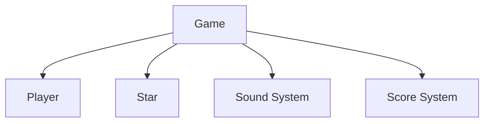
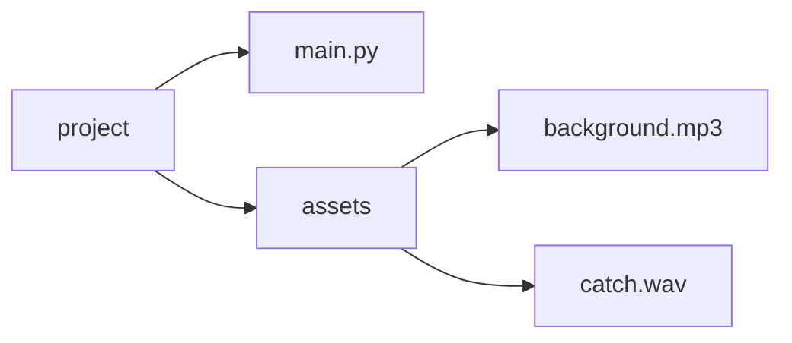
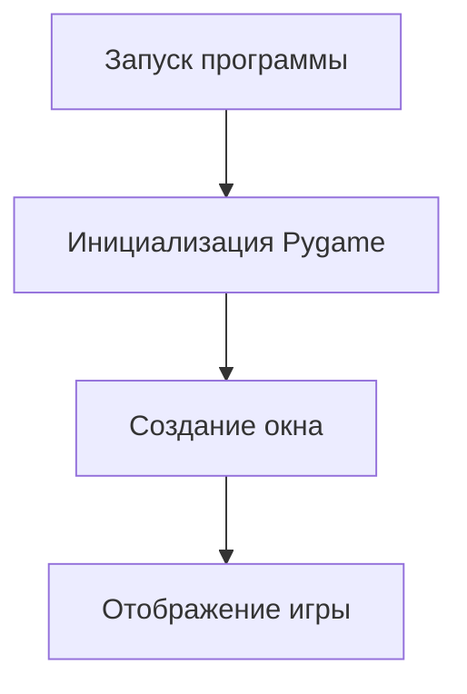
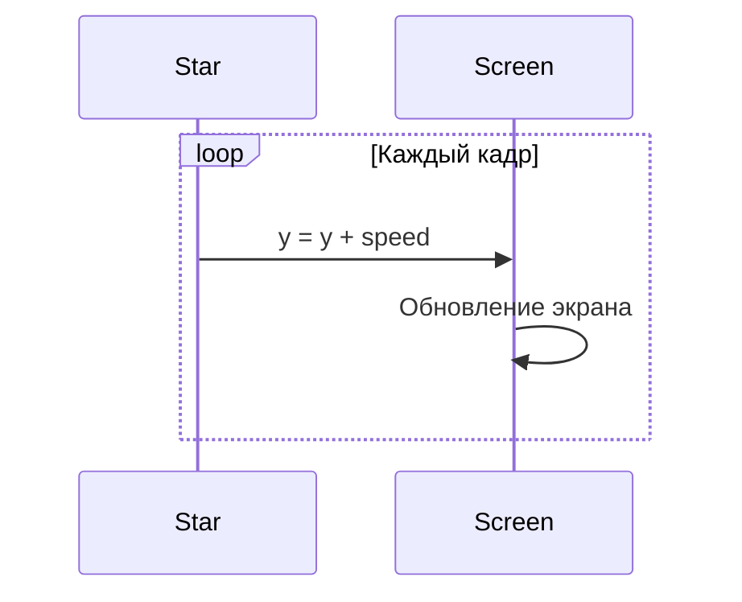
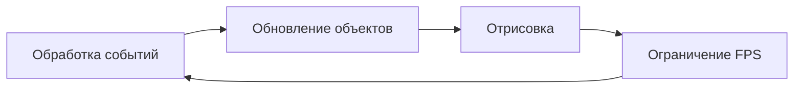
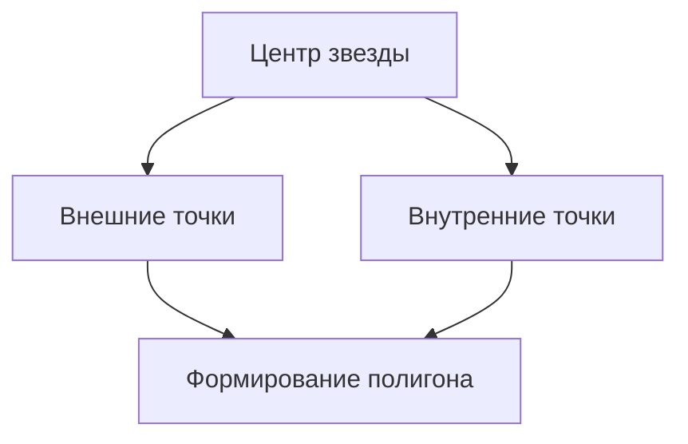
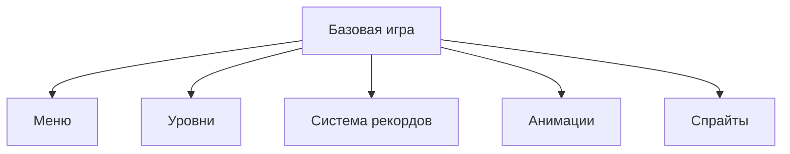

# Отчет по разработке игры «Star Catcher» на Python и Pygame

## Содержание

1. Введение
2. Исследование предметной области
3. Анализ архитектуры проекта
4. Подготовка среды разработки
5. Структура проекта
6. Пошаговая разработка игры
7. Разбор исходного кода
8. Добавление графики и звука
9. Тестирование и отладка
10. Возможные улучшения
11. Заключение

---

# 1. Введение

В данном отчете рассматривается процесс создания простой 2D-игры «Star Catcher» с использованием библиотеки Pygame.

Игрок управляет платформой и ловит падающие звезды. За каждую пойманную звезду начисляются очки. Если игрок пропускает слишком много объектов, игра завершается.

Цель проекта:

* изучить основы разработки игр;
* освоить библиотеку Pygame;
* научиться работать с графикой, событиями и звуком;
* реализовать игровой цикл;
* создать полноценное игровое приложение.

---

# 2. Исследование предметной области

## 2.1 Что такое Pygame

Pygame — это библиотека Python для создания 2D-игр.

Она предоставляет:

* работу с окнами;
* обработку клавиатуры и мыши;
* проигрывание звука;
* отображение изображений;
* анимацию;
* обработку столкновений.

Pygame часто используют начинающие разработчики, потому что библиотека имеет простой синтаксис и большое количество обучающих материалов.

---

## 2.2 Исследование игровой механики

В основе игры лежат несколько ключевых механик:

| Механика           | Описание                            |
| ------------------ | ----------------------------------- |
| Управление игроком | Игрок перемещается по оси X         |
| Генерация объектов | Звезды появляются случайным образом |
| Столкновения       | Проверка касания игрока и звезды    |
| Подсчет очков      | За успешную ловлю начисляются баллы |
| Game Over          | Игра завершается после 3 пропусков  |

---

# 3. Анализ архитектуры проекта

Игра построена по объектно-ориентированному принципу.

Используются следующие классы:

* `Player` — управление игроком;
* `Star` — поведение падающей звезды;
* `Game` — основной игровой цикл.

---

## Иллюстрация 1. Общая архитектура игры



---

# 4. Подготовка среды разработки

## 4.1 Установка Python

Скачайте Python с официального сайта:

```text
https://python.org
```

Во время установки обязательно включите опцию:

```text
Add Python to PATH
```

---

## 4.2 Установка Pygame

Откройте терминал и выполните:

```bash
pip install pygame
```

Проверка установки:

```bash
python -m pygame.examples.aliens
```

Если открылась тестовая игра, библиотека установлена правильно.

---

## 4.3 Создание структуры проекта

Создайте следующую структуру:

```text
project/
│
├── main.py
├── assets/
│   ├── background.mp3
│   └── catch.wav
```

---

## Иллюстрация 2. Структура проекта



---

# 5. Последовательность действий по исследованию предметной области и созданию технологии

## Этап 1. Изучение основ Python

Необходимо изучить:

* переменные;
* циклы;
* функции;
* классы;
* списки;
* импорт библиотек.

---

## Этап 2. Изучение библиотеки Pygame

Основные темы:

* создание окна;
* работа с FPS;
* обработка событий;
* рисование объектов;
* коллизии;
* воспроизведение звука.

---

## Этап 3. Проектирование игры

На данном этапе определяется:

* игровая механика;
* правила;
* интерфейс;
* система очков;
* условия победы и поражения.

---

## Этап 4. Реализация классов

Создаются:

* класс игрока;
* класс падающих объектов;
* основной игровой класс.

---

## Этап 5. Реализация игрового цикла

Игровой цикл отвечает за:

* обновление экрана;
* обработку ввода;
* обновление объектов;
* контроль FPS.

---

## Этап 6. Добавление звука

Подключаются:

* фоновая музыка;
* звуки ловли объектов.

---

## Этап 7. Тестирование

Проверяются:

* столкновения;
* производительность;
* корректность счета;
* завершение игры.

---

# 6. Пошаговая разработка игры

# Шаг 1. Импорт библиотек

```python
import pygame
import random
import sys
import math
```

Описание:

| Библиотека | Назначение                   |
| ---------- | ---------------------------- |
| pygame     | Игровая библиотека           |
| random     | Генерация случайных значений |
| sys        | Завершение программы         |
| math       | Математические функции       |

---

# Шаг 2. Инициализация Pygame

```python
pygame.init()
pygame.mixer.init()
```

Что происходит:

* запускается графическая система;
* активируется звуковой движок.

---

# Шаг 3. Настройка окна

```python
SCREEN_WIDTH = 800
SCREEN_HEIGHT = 600

screen = pygame.display.set_mode((SCREEN_WIDTH, SCREEN_HEIGHT))
pygame.display.set_caption("Star Catcher")
```

---

## Иллюстрация 3. Создание игрового окна



---

# Шаг 4. Создание класса Player

```python
class Player:
    def __init__(self, x, y):
        self.x = x
        self.y = y
        self.width = 50
        self.height = 50
```

Класс отвечает за:

* координаты игрока;
* размеры;
* движение;
* отображение.

---

# Шаг 5. Реализация движения игрока

```python
def move(self, mouse_x):
    self.x = mouse_x - self.width // 2
```

Игрок движется за курсором мыши.

Ограничение движения:

```python
if self.x < 0:
    self.x = 0
```

---

# Шаг 6. Создание класса Star

```python
class Star:
    def __init__(self):
        self.reset()
```

Метод `reset()` создает новую звезду.

---

# Шаг 7. Случайное появление звезд

```python
self.x = random.randint(0, SCREEN_WIDTH - STAR_SIZE)
```

Каждая звезда появляется в случайной позиции.

---

# Шаг 8. Анимация падения

```python
def update(self):
    self.y += self.speed
```

Каждый кадр объект опускается вниз.

---

## Иллюстрация 4. Движение звезд



---

# Шаг 9. Проверка столкновений

```python
if self.player.get_rect().colliderect(self.star.get_rect()):
    self.score += 10
```

Функция `colliderect()` проверяет пересечение объектов.

---

# Шаг 10. Реализация Game Over

```python
if self.missed >= 3:
    self.game_over = True
```

После трех пропущенных звезд игра заканчивается.

---

# 7. Разбор игрового цикла

Игровой цикл — основа любой игры.

```python
while self.running:
    self.handle_events()
    self.update()
    self.draw()
```

---

## Иллюстрация 5. Игровой цикл



---

# 8. Работа со звуком

## Подключение музыки

```python
pygame.mixer.music.load("assets/background.mp3")
pygame.mixer.music.play(-1)
```

Параметр `-1` означает бесконечное воспроизведение.

---

## Подключение звуковых эффектов

```python
self.catch_sound = pygame.mixer.Sound("assets/catch.wav")
```

Воспроизведение:

```python
self.catch_sound.play()
```

---

# 9. Отрисовка объектов

## Отрисовка игрока

```python
pygame.draw.rect(screen, BLUE, (self.x, self.y, self.width, self.height))
```

---

## Отрисовка звезды

```python
pygame.draw.polygon(screen, self.color, points)
```

Используется список координат многоугольника.

---

## Иллюстрация 6. Формирование звезды



---

# 10. Система подсчета очков

```python
self.score += 10
```

Дополнительно ведется статистика:

```python
self.stars_caught += 1
self.missed += 1
```

---

# 11. Тестирование проекта

## Проверка функциональности

| Проверка      | Ожидаемый результат          |
| ------------- | ---------------------------- |
| Движение мыши | Игрок двигается              |
| Падение звезд | Звезды падают                |
| Столкновения  | Очки увеличиваются           |
| Пропуск звезд | Увеличивается счетчик ошибок |
| Game Over     | Игра завершается             |

---

## Типичные ошибки

### Ошибка

```text
ModuleNotFoundError: No module named pygame
```

### Решение

```bash
pip install pygame
```

---

### Ошибка

```text
pygame.error: mixer not initialized
```

### Решение

```python
pygame.mixer.init()
```

---

# 12. Оптимизация игры

Для повышения производительности рекомендуется:

* не создавать лишние объекты;
* ограничивать FPS;
* использовать спрайты;
* минимизировать количество вычислений внутри цикла.

---

# 13. Возможные улучшения проекта

## Идеи для развития

### Добавление уровней

Игрок проходит несколько этапов сложности.

### Добавление меню

Можно создать:

* главное меню;
* настройки;
* экран паузы.

### Использование изображений

Вместо примитивов можно применять PNG-спрайты.

### Добавление врагов

Например:

* астероиды;
* метеоры;
* ловушки.

### Таблица рекордов

Сохранение результатов в файл.

---

## Иллюстрация 7. Возможное развитие проекта



---

# 14. Полный пример запуска игры

```python
if __name__ == "__main__":
    import math

    game = Game()
    game.run()
```

После запуска:

1. создается окно;
2. запускается игровой цикл;
3. начинается обработка событий;
4. выполняется обновление кадров.

---

# 15. Рекомендации начинающим разработчикам

## Полезные советы

* Начинайте с простых игр.
* Делите проект на маленькие задачи.
* Используйте Git для хранения версий.
* Регулярно тестируйте проект.
* Пишите комментарии в коде.

---

# 16. Заключение

В ходе разработки была создана полноценная 2D-игра на Python с использованием Pygame.

В проекте реализованы:

* игровой цикл;
* обработка событий;
* система столкновений;
* работа со звуком;
* анимация;
* система очков;
* экран завершения игры.

Данный проект хорошо подходит для изучения основ разработки игр и объектно-ориентированного программирования.

Полученные знания можно использовать для создания более сложных игровых приложений.
